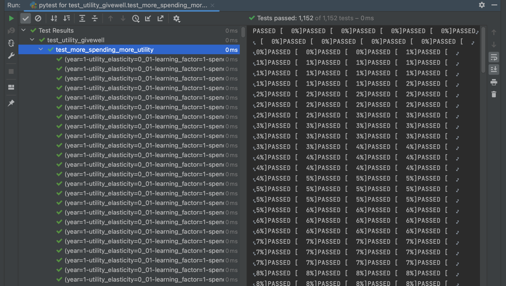

# Dependency management
## Basics
Basic best practices for dependency management include:
- Using virtual environment
- Specifying version numbers

Using a good package manager simplifies these tasks.

Good dependency management is essential:
- If you don't specify dependencies, a new user has to manually track down every missing dependency and install it on their machine before being able to run the code!! If your user (correctly) uses virtual envs, every missing dependency will be _every_ dependency.
- If you don't specify dependencies precisely enough (e.g. a `requirements.txt` without version numbers), multiple people working on the same project might not have the same environment (the "it works on my machine" problem)
- If you don't use virtual environments, your program might randomly break when its dependencies are updated by some other work you're doing on the same computer. If you ever want to deploy your application to a server, you also have to specify dependencies exhaustively.
- etc, etc...

There are many guides to dependency management online. I generally find the content from RealPython to be quite good, and they have this [course](https://realpython.com/courses/managing-python-dependencies/) on dependency management. (Since it's not fee, I haven't been able to read it).

## Choice of package manager
Dependency management in Python has long been widely known to be much messier than other leading languages. With the arrival of more modern tools, Python has caught up, but it's still a worse experience than e.g. Ruby.

`pip` is the traditional package manager / downloader. There are a number of newer tools that are IMO greatly superior, so that one should simply not use `pip` in 2022. The ones I know of are `pipenv`, `conda` and `poetry`. I use [Poetry](https://python-poetry.org/) on all my projects; I weakly think it's the best one.

## Advanced topic: Python version management
Ideally, you'd also isolate the version of Python that is being used by your project, instead of just using the system version. If you use Poetry, it will let you specify version(s) in the `pyproject.toml` file.

There are several tools for using different version of Python in parallel on your computer. The one I use is [`pyenv`](https://github.com/pyenv/pyenv).

# Subclassing
In [`distributions.py`](/opmodel/stats/distributions.py) it looks like you've copied and pasted the entire `JointDistribution` class, as far as I can tell in order to modify the `.rvs` method to allow for conditional sampling.

Almost all languages, and in particular so-called "object-oriented" languages, support a feature called "subclassing" (see e.g. [Inheritance and Composition: A Python OOP Guide](https://realpython.com/inheritance-composition-python/)). Subclassing lets you take a class and modify just some aspects of its functionality, inheriting the rest from the parent class. The basic syntax is `class ChildClass(BaseClass)`. For example:

```python
class BaseClass:
	def method_A(self):
		return "A"
	def method_B(self):
		return "B"

class ChildClass(BaseClass):
	def method_B(self):
		return "beta"
```

```python-repl
>>> c = ChildClass()
>>> c.method_A()
A
>>> c.method_B()
beta
```

So there is no need to copy and paste entire class definitions. You could simply have written:

```python
from copula_wrapper import JointDistribution

class ConditionalJointDistribution(JointDistribution):
	def rvs(self):
		# Get conditional values
		fixed_values = [marginal.cdf(conditions.get(name, np.nan)) for (name, marginal) in self.marginals.items()]

	# ... continuation of your code here
```

Your copy and paste approach also forces you to copy and paste the `get_pearsons_rho` function. If you took `copula_wrapper` as a dependency you wouldn't have to worry about its internals.


# Imports and modules
You may benefit from reading the [Python tutorial on modules](https://docs.python.org/3/tutorial/modules.html)

## Relative imports
Relative imports such as these
```python
from ..core.utils import log, get_parameter_table, get_rank_correlations, get_clipped_ajeya_dist
```
Are generally considered bad practise. They mean that your code will behave differently depending on where it's being imported/called from! And that may not be the place [you think](https://stackoverflow.com/a/65589847/8010877):

> If you write `from . import module`, opposite to what you think, `module` will not be imported from current directory, but from the top level of your package! If you run `.py` file as a script, it simply doesn't know where the top level is and thus refuses to work.

It's generally considered better to do the explicit:

```python
from opmodel.core.utils import log, get_parameter_table, get_rank_correlations, get_clipped_ajeya_dist
```

In `megareport.py` you have exactly this situation:

```python
from . import log
from . import *

from .report import Report
```
```
❯ python opmodel/analysis/megareport.py
Traceback (most recent call last):
  File "/Users/t/repos/opmodel/opmodel/analysis/megareport.py", line 1, in <module>
    from . import log
ImportError: attempted relative import with no known parent package
```

I see in [your README.md](../README.md) that you're using the `-m` option to run it. As you can see by running `python -h`, this option means "run library module as a script". I prefer to keep package modules on the one hand, and scripts on the other, completely non-overlapping. IMO, a package module should not do script-like stuff like generating a report, and any script should be runnable directly (I've never used `python -m` before).

## Don't import in `__init__.py`
There's ≈never any reason to do this:

```python
# opmodel/analysis/__init__.py

import os
import sys
import pandas as pd
import numpy as np
import matplotlib.pyplot as plt
import argparse
```

Import modules where you need them, not in the package initializer.

The tutorial [explains](https://docs.python.org/3/tutorial/modules.html#packages) what `__init__` files are used for:

> The `__init__.py` files are required to make Python treat directories containing the file as packages. This prevents directories with a common name, such as string, unintentionally hiding valid modules that occur later on the module search path. In the simplest case, `__init__.py` can just be an empty file, but it can also execute initialization code for the package or set the `__all__` variable, described later.


For example, right now your `opmodel` directory is not a package, whereas `analysis`, `core`, and `stats` are packages. I think `opmodel` should probably be a package too.

## Don't `import *`

One should never do this:

```python
from opmodel.core.utils import *
```

This is explained well [on StackOverflow](https://stackoverflow.com/questions/2386714/why-is-import-bad) and many other places. Why is `import *` bad?

> - Because it puts a lot of stuff into your namespace (might shadow some other object from previous import and you won't know about it).
> - Because you don't know exactly what is imported and can't easily find from which module a certain thing was imported (readability).
> - Because you can't use cool tools like pyflakes to statically detect errors in your code.

# Accessing class attributes
In Python, there's no need to write getter functions like this:

```python
class ParamsDistribution:
	# ... more methods here

	def get_marginals(self):
		return self.marginals

	def get_rank_correlations(self):
		return self.pairwise_rank_corr
```

You can just access the attributes directly:

```python
pd = ParamsDistribution()
pd.marginals
pd.pairwise_rank_corr
```

It's very rare you would want explicit setters and getters. For those cases, you can look at the [`@property` decorator](https://realpython.com/python-property/).

# Conditional distributions
You're using conditional distributions in a few places in [`distributions.py`](/opmodel/stats/distributions.py):

- the `.rvs` method of `JointDistribution`
- the `sample_normal_cond` method of `GaussianCopula`

There was an extended discussion about this [on Slack](https://tadamcz.slack.com/archives/C03GMA1PC03/p1666795355505989).

I originally thought you could achieve what you want without even modifying `JointDistribution`, but this may not be possible (thanks Eduardo!).

If you _do_ have to access the wrapped `CopulaDistribution`, then you should do this by modifying the functionality of `JointDistribution` (you can subclass, or you can open a PR to `copula_wrapper`), not by accessing `joint_distribution.wrapped` anywhere else (I don't think I've seen you do this anywhere, but just to be clear).

## Meaning of cop_args?
Have you tested that this line:

```python
rvs = self.wrapped.rvs(nobs=nobs, random_state=random_state, cop_args = fixed_values)
```

does what you expect?

The following from the `statsmodels` docs makes me think `cop_args` is for parametrising the distribution, not for evaluating it at particular points. But I don't understand copulas well at all, so I may well be wrong. If you've tested this, then great!

```
cop_args : tuple
    Copula parameters. If None, then the copula parameters will be
    taken from the ``cop_args`` attribute created when initiializing
    the instance.
marg_args : list of tuples
    Parameters for the marginal distributions. It can be None if none
    of the marginal distributions have parameters, otherwise it needs
    to be a list of tuples with the same length has the number of
    marginal distributions. The list can contain empty tuples for
    marginal distributions that do not take parameter arguments.
```

## Two implementations?
I don't understand why you have the modified `JointDistribution` _as well as_ the `class GaussianCopula(sm_api.GaussianCopula)`. Is this duplicate functionality?

The method `sample_normal_cond` is very hard to follow. It makes me think "a mathematician wrote this code" :).

# The `ParamsDistribution` class
## Name of class
From the `__init__`, it looks like it's a class specific to your model (e.g. you're calling `get_parameter_table()`). In that case, I would make that more obvious in the name, like `TakeoffParamsDistr`. `ParamsDistribution` makes it seem like something more generic. If it is something more generic, then you should pass in the "parameter table" etc. as arguments, not have them hard-coded in the `__init__`.

## Constructor (`__init__`)
For readability, it would be good to break up the method a bit.

You're setting up the three dictionaries `pairwise_rank_corr`, `marginals`, and `directions` in one big block. Instead, you could have the methods `marginals` and `correlations` for example.

Here's an illustration of `correlations` as a method:

```python
class ParamsDistribution:
	def __init__(self):
		# ... more code here

		self.pairwise_rank_corr = self.correlations(ignore_rank_correlations, marginals, rank_correlations, directions)

	def correlations(self, ignore_rank_correlations, marginals, rank_correlations, directions):
		correlations = {}
		if not ignore_rank_correlations:
			for left in marginals.keys():
				for right in marginals.keys():
					if right not in rank_correlations or left not in rank_correlations:
						continue

					if isinstance(marginals[right], PointDistribution) or isinstance(marginals[left],PointDistribution):
						continue

				r = rank_correlations[right][left]
				if not np.isnan(r) and r != 0:
					correlations[(left, right)] = r * directions[left] * directions[right]
		return correlations
```

Apart from breaking separate functionality into more readable chunks, this has some other advantages. First, you can explicitly see what the correlations depend on simply by looking at the method signature. Also, you can move the statement `if not ignore_rank_correlations` to a place where it has less impact on readability (imo), like this:

```python
class ParamsDistribution:
	def __init__(self):
		# ... more code here

		if not ignore_rank_correlations:
			self.pairwise_rank_corr = self.correlations(marginals, rank_correlations, directions)
		else:
			self.pairwise_rank_corr = {}

	def correlations(self, marginals, rank_correlations, directions):
		correlations = {}
		for left in marginals.keys():
			for right in marginals.keys():
				if right not in rank_correlations or left not in rank_correlations:
					continue

				if isinstance(marginals[right], PointDistribution) or isinstance(marginals[left],PointDistribution):
					continue

			r = rank_correlations[right][left]
			if not np.isnan(r) and r != 0:
				correlations[(left, right)] = r * directions[left] * directions[right]
		return correlations
```

## Input validation
From the line

```python
r = rank_correlations[right][left]
```

I'm guessing that the `rank_correlations` comes in as an `n * n` dict of dicts (or similar), where `n` is the number of dimensions.

This opens up the possibility that the user provides inconsistent inputs (where `rank_correlations[right][left] != rank_correlations[left][right]`), that are then silently swallowed (your code will just pick one of them, depending on the order of your nested for loops).

This could happen pretty easily, you have to assume that the user might be distracted and is dealing with a large matrix of correlations. You could either:

1. Raise an explicit error when the inputs are inconsistent.
2. Format the input in such a way that it's impossible for the user to contradict themselves.

# `core/opmodel.py`, the `SimulateTakeOff` class

The methods in here that mostly do mathematical operations are verbose and were hard for me to follow without putting in a huge effort, so I'm mostly not focusing on them. Investing in readability is not always worth it, that depends on your trade-offs. But you should be aware that for an external reviewer most of the math methods e.g. (`hardware_rnd_production`) are  ≈incomprehensible right now.

## Class length and number of attributes
The very first thing I notice here is that the module is nearly 2000 lines long and consists of a single class!

In addition to _doing_ just about everything, your class also _contains_ just about every piece of information as an instance attribute: every model parameter, and all computed results for every time step, stored in big lists. This means that an instance of `SimulateTakeOff` is essentially an "everything object", and all variables are essentially global variables.

Very broadly, you could think of Python modules ([see section](#imports-and-modules)) as little chunks of code a few hundred lines long that do something specific (though obviously such a rule of thumb is a very simplistic one).

The length of modules is more of a matter of taste, because it could well make sense to have many small classes or functions in a very big module. However, I would especially avoid having a single class or function as long as this one.


## Method length
Many of the methods could be broken down into smaller ones. This sort of thing is a good start, and you could push it further:

```python
def production(self, t_idx):
	self.goods_production(t_idx)
	self.hardware_rnd_production(t_idx)
	self.software_rnd_production(t_idx)
```

More importantly I think you should also break the class apart, which I will explain in the next section.

## Suggestion to refactor class into functions
### Summary
I would lean towards re-writing this as a set of functions instead of methods of a class.

To begin with, this is necessary for splitting up the massive class. But there are several other reasons, some of which are stronger than simply to split up the class: 

1. I think a class does not make much conceptual sense here. Classes should be used to create objects, usually long-lived, that encapsulate and abstract away some functionality that "belongs to" that object. Classes should not be used as "folders of functions", use modules for that. 
2. It will let you be more explicit about what each function depends on and returns. This will make it easier to reason about the program and write unit tests for individual pieces of functionality.
3. The functions can be organised into multiple shorter modules. If done well this can improve readability and give the reader a sense of the structure of your code just from looking at the file tree.

I'll expand on these points a bit, because some are a bit subtle.

A class should be used to create objects (instances of that class), where the methods of the class let you do things to or with the object. They should not simply be used simply to group conceptually related functions together. 

For example, this class from a [Python tutorial](http://introtopython.org/classes.html) gives a good example of the use of a class:

```python
from math import sqrt

class Rocket():
    # Rocket simulates a rocket ship for a game,
    #  or a physics simulation.
    
    def __init__(self, x=0, y=0):
        # Each rocket has an (x,y) position.
        self.x = x
        self.y = y
        
    def move_rocket(self, x_increment=0, y_increment=1):
        # Move the rocket according to the paremeters given.
        #  Default behavior is to move the rocket up one unit.
        self.x += x_increment
        self.y += y_increment
        
    def get_distance(self, other_rocket):
        # Calculates the distance from this rocket to another rocket,
        #  and returns that value.
        distance = sqrt((self.x-other_rocket.x)**2+(self.y-other_rocket.y)**2)
        return distance
```

An example of where you're doing the "bag of functions" anti-pattern might be:

```python
class SimulateTakeOff:
	def compute_takeoff_metrics(self):
		self.takeoff_metrics = {}
		self.compute_doubling_times()
		self.takeoff_metrics["cog_output_multiplier"] = \
			self._length_between_thresholds(
				self.automation_multiplier_rnd > 2,
				self.automation_multiplier_rnd > 10,
			)
		
		# etc.

		
	def compute_doubling_times(self):
		self.doubling_times = [self.t_step / np.log2(self.gwp[1] / self.gwp[0])]
		if self.rampup_start is not None:
			reference_idx = self.time_to_index(self.rampup_start)
			for idx in range(reference_idx, len(self.timesteps)):
				if self.gwp[idx] > 2 * self.gwp[reference_idx]:
					self.doubling_times.append(self.index_to_time(idx) - self.index_to_time(reference_idx))
					reference_idx = idx
		# etc.
```

With `SimulateTakeOff` it's hard to see what the object is you're creating. A hint of this is that "a `SimulateTakeOff`" does not make sense grammatically because "simulate" is a verb, whereas we can sensibly say "a `Rocket`".  This class is more like a way of calling many methods like `compute_takeoff_metrics`, `compute_doubling_times`, etc., in some specified order.

Every method in Python depends on the entire instance object (usually called `self`) as its first argument. The exception are static methods that I saw you declared a few of. (If you had a class consisting entirely of static methods, it would be very obvious that it's a bag of functions, but most cases are more subtle).

If your instance is big (has many attributes), then taking `self` as an argument is not very explicit. You are saying this method could potentially depend on and modify any attribute of `self`. In the case of `SimulateTakeOff` instances, which contain all relevant parameters and the entire results of the model for every previous time step, this is approximately as un-explicit as it's possible to be. From looking at method signature like `def hardware_rnd_production(self, t_idx)`, I have no idea what hardware R&D production depends on or modifies in your model, I have to carefully read every line of the method to see which attributes of `self` it accesses. 

### Example refactor for `compute_runtime_requirements`
In this example, you depend on `self` but are only using `runtime_training_tradeoff`:
```python
class SimulateTakeOff:
	def compute_runtime_requirements(self, automation_training_flops, automation_runtime_flops, biggest_training_run):
		with np.errstate(under='ignore'):
			# Ignore underflows (we are taking care of them below with np.maximum)
			runtime_requirements = automation_runtime_flops
			if self.runtime_training_tradeoff is not None:
				runtime_requirements = runtime_requirements * (
							automation_training_flops / biggest_training_run) ** self.runtime_training_tradeoff
		runtime_requirements = np.maximum(1., runtime_requirements)  # Requirements cannot fall below 1
		return runtime_requirements
```

so you could have written:

```python
def compute_runtime_requirements(runtime_training_tradeoff, automation_training_flops, automation_runtime_flops, biggest_training_run):
		with np.errstate(under='ignore'):
			# Ignore underflows (we are taking care of them below with np.maximum)
			runtime_requirements = automation_runtime_flops
			if runtime_training_tradeoff is not None:
				runtime_requirements = runtime_requirements * (
							automation_training_flops / biggest_training_run) ** runtime_training_tradeoff
		runtime_requirements = np.maximum(1., runtime_requirements)  # Requirements cannot fall below 1
		return runtime_requirements
```

### Another example of how refactor will make things more explicit 
Taking all previous time-steps as an argument is a particularly strong example of the "everything object" phenomenon I described above. If I understand correctly what's going on in `reinvest_output_in_inputs` and the three methods (`update_rnd_state`, `allocate_fractional_inputs`, `calculate_total_inputs`) it calls, in your model each time-step depends only on:

1. Constants (model parameters that don't change from one year to another)
2. The previous year (`t_idx - 1`)
3. The year before the previous year (`t_idx - 2`)

And each time-step modifies only itself. 

This is an important property of the model that isn't apparent from your code structure or method signatures. With a functional approach you could make this explicit with something like this:

```python
class TimeStep:
	# Define whatever attributes you need here
	# 
	# In reality, you wouldn't want to have a class exactly like this, as this is again a huge object containing too many attributes,
	# but at least it only contains the attributes for one time step, which is what I'm demonstrating in this snippet.

def hardware_rnd_production(
		labour,
		capital,
		step_minus_1,
		step_minus_2,
		# lots of other arguments...
		):
	
	# Calculate Hardware R&D production...

	return production

steps = []
for i in range(100):
	step = TimeStep()
	if i > 1:
		step.hardware_rnd_prod = hardware_rnd_production(labour, capital, steps[i-1], steps[i-2])
	steps.append(step)
```

A closely related problem with your approach is that lots of methods have to depend on the time-step `t_idx`, even though conceptually what they are doing does not depend on the current time. They do the same thing every year, with the possible exception of the first year.

### Unit tests
See also [general remarks on tests](#general-remarks-on-tests).

Making your code more explicit in the way I described above is a good idea for many reasons, but is going to be especially beneficial for testing.

_Unit tests_ are tests of a small piece of code like a function or method, while _integration tests_ check that different components of your code work together as expected. _End to end_ tests are very wide integration tests that make assertions about the behaviour of the entire program or very large parts of it.

Just like we want to write modular code, we also want modular tests. Other things being equal, it's better for each test to check a very narrow piece of functionality. In an ideally written test suite, a failing test should immediately point out to you where in your code the problem lies. So you should have many unit tests and fewer integration tests.

#### Easier test creation
If your method depends on an enormous `self` object, you'll have to instantiate that enormous object in any tests. This will make your tests hard to understand and verbose.

Right now if I run your test suite, many tests fail with:


```
Traceback (most recent call last):
  File "/Users/t/repos/opmodel/tests/tests.py", line 20, in test_basic_checks
    model = SimulateTakeOff()

TypeError: __init__() missing 62 required positional arguments: 'full_automation_requirements_training', 'flop_gap_training', 'goods_vs_rnd_requirements_training', 'full_automation_requirements_runtime', 'flop_gap_runtime', 'goods_vs_rnd_requirements_runtime', 'runtime_training_tradeoff', 'runtime_training_max_tradeoff', 'labour_substitution_goods',

# etc...
```

As currently written, you would have to pass in all these arguments in every test.

#### Powerful guarantees without repetition 
In one of your tests, you make an assertion about growth from step 0 to step 1:

```python
def test_basic_checks(self):
	# Create model
	model = SimulateTakeOff()
	
	# Initial capital growth matches initial gwp growth
	initial_capital_growth =\
	  np.log(model.capital[1]/model.capital[0]) / model.t_step
	self.assertAlmostEqual(initial_capital_growth, model.initial_gwp_growth, places=2)
```

But (at least theoretically) it would be better to check this for every time-step rather than just one. You could have a bug that happens not to affect the first year. In fact, some of your tests make assertions about every time-step using `np.all`, e.g.:
```python
self.assertTrue(np.all(model.task_input_rnd >= 0.))
```

If you wrote functions that compute a single time-step, and that do not take the time-step as an argument (see my suggested sketch for `hardware_rnd_production` above), testing them once would be sufficient to know the behaviour is what you expect _every year_:

```python

previous_year = TimeStep(labour=12, capital=12)
assert hardware_rnd_production(labour=1, capital=0, previous_year=previous_year) == 42
```

#### Example
Unit tests of mathematical model code could look something like [this](https://github.com/tadamcz/timing-spend-down-epoch-copy/blob/aa8367a82ff5bbda8ab7da053490a54a917846cc/tests/utility_model/test_utility_givewell.py#L42-L58), where `utility_givewell` is a small function with six arguments, and we only need to define these 6 in a test: 

```python
def test_zero_elasticity(givewell_initial, annual_change_rates, learning_factor, year, spending, factor):
	"""
	When ``utility_elasticity = 0``, N times as much GiveWell spending gives N times as much utility.
	"""
	utility_elasticity = 0
	kwargs = {
		"givewell_initial": givewell_initial,
		"utility_elasticity": utility_elasticity,
		"annual_change_rates": annual_change_rates,
		"learning_factor": learning_factor,
		"year": year,
	}

	u_1 = utility_givewell(amount=spending, **kwargs)
	u_2 = utility_givewell(amount=spending * factor, **kwargs)
	assert u_2 == pytest.approx(factor * u_1)
```


## Constructor (`__init__`)
### Arguments
You have an absolutely massive number of arguments (101 lines!). This is a sign that these arguments should be refactored into more complex objects.

Luckily, it seems like you have some clear categories of parameters, like "automation thresholds", "production", etc.

```python
# Automation thesholds
full_automation_requirements_training,
flop_gap_training,
goods_vs_rnd_requirements_training,

full_automation_requirements_runtime,
flop_gap_runtime,
goods_vs_rnd_requirements_runtime,

runtime_training_tradeoff,
runtime_training_max_tradeoff,

# Production
labour_substitution_goods,
labour_substitution_rnd,
capital_substitution_goods,
capital_substitution_rnd,

# R&D parameters
hardware_returns,
software_returns,
hardware_performance_ceiling,
software_ceiling,
rnd_parallelization_penalty,
hardware_delay,
```

Parameters that go together logically and are used together in the code can be encapsulated into a class. Python's `dataclasses` module and the `@dataclass` decorator offers a concise way to specify such simple classes. For example, you might write:

```python
from dataclasses import dataclass

@dataclass
class AutomationThresholds:
	full_automation_requirements_training: object

	# You can add optional type annotations
	goods_vs_rnd_requirements_training: float

# etc...

from opmodel.core.opmodel import SimulateTakeOff

at = AutomationThresholds(full_automation_requirements_training=42, goods_vs_rnd_requirements_training=1.23)
SimulateTakeOff(
	at,
	# other arguments here
)
```

You can also nest dataclasses to specify inputs in an even more structured way:
 

```python
from dataclasses import dataclass


@dataclass
class GrowingValue:
	initial: float
	growth: float
	ceiling: float = float('inf')

@dataclass
class RnDInputs:
	labour: GrowingValue
	compute: GrowingValue
	capital: GrowingValue = None


@dataclass
class RnD:
	hardware: RnDInputs
	software: RnDInputs

rnd = RnD(
	hardware=RnDInputs(
		capital=GrowingValue(1/5, 1/2), # absence of `ceiling` is treated as infinite ceiling
		labour=GrowingValue(1/2, 2/3, 1),
		compute=GrowingValue(1/5, 1, 1),  # positional args
	),
	software=RnDInputs(
		labour=GrowingValue(1, growth=0, ceiling=1),  # mix of positional and keyword args
		compute=GrowingValue(1, growth=0, ceiling=1),
	)
)

# Example usage:
x = rnd.software.capital.growth
y = rnd.hardware.labour.ceiling
```

The single variable `rnd` replaces these 15 variables:
```python
frac_capital_hardware_rnd_growth
frac_labour_hardware_rnd_growth
frac_compute_hardware_rnd_growth

frac_labour_software_rnd_growth
frac_compute_software_rnd_growth

frac_capital_hardware_rnd_ceiling
frac_labour_hardware_rnd_ceiling
frac_compute_hardware_rnd_ceiling

frac_labour_software_rnd_ceiling
frac_compute_software_rnd_ceiling

initial_frac_capital_hardware_rnd
initial_frac_labour_hardware_rnd
initial_frac_compute_hardware_rnd

initial_frac_labour_software_rnd
initial_frac_compute_software_rnd
```

Whenever you are repeating yourself a lot (like in the names of these variables), it's a sign that there's some structure to the program that you're not exploiting. In this case using the structure of the input data, we've eliminated some repetition and made the code easier to read, test, and maintain.  I think this could be applied in many places in `SimulateTakeOff`.

I used dataclasses [here](https://github.com/tadamcz/timing-spend-down-epoch-copy/blob/aa8367a82ff5bbda8ab7da053490a54a917846cc/timing_spend_down/containers.py). My comment is a good example that putting lots of parameters in a class that are not used together will create more verbosity, not less:

```
Note: I am explicitly choosing not to combine ``exogenous_spending_initial`` and ``g_exogenous_spending`` into a container class,
because, while the two parameters are conceptually connected, they are not always used together.
```

Note by default all dataclasses are mutable, and hence not hashable, which means they cannot be used as keys in dictionary-like data structures, cannot be cached, etc. To create a hashable dataclass you can use `@dataclass(frozen=True)`.

There's [far more you can do with dataclasses](https://realpython.com/python-data-classes/).


### Use of `setattr` and `eval`

You should not use `eval` like here:
```python
# Add all inputs to model parameters
for item in inspect.signature(SimulateTakeOff).parameters:
	setattr(self, item, eval(item))
```

1. Conceptually, treating a string as if it were code is a sign that things have gone wrong. A string is an object _inside_ your program, it should never be used to control your program's flow.
2. `eval`-ing third party input is a massive security risk. In this case, you're inspecting the signature, not third-party input, so it's not so bad. But if for example you were to run `eval` on inputs from a Google Sheets spreadsheet, _everyone who can edit that spreadsheet could run arbitrary code on your computer_. 

What you're trying to achieve in the above snippet is exactly what dataclasses are intended for.

Use of `setattr` is a  mild warning sign, because you're setting attributes that could be arbitrary strings. Is there a way to add structure to your objects so that this isn't required?

## Method `check_input_validity`
Minor point: this checker is far from exhaustive as far as I can tell. It's up to you what trade-offs you want to make here. If the user is very knowledgeable about the model it may be fine to let the user deal with the consequences of invalid input. If the model is more widely shared, you probably want to be more explicit. 

## Method `process_input_parameters`
If something is a constant like the below, it shouldn't be in a method called `process_input_parameters`.
```python
# Define initial quantities
self.initial_software = 1
self.initial_tfp_goods = 1
self.initial_tfp_rnd = 1
self.investment_rate = 0.2
```

One alternative would be to set constants as class variables instead of instance variables (and by convention capitalize them):

```python
class SimulateTakeoff:
	INITIAL_SOFTWARE = 1
	INITIAL_TFP_GOODS = 1
	INITIAL_TFP_RND = 1
	INVESTMENT_RATE = 0.1
```

## Method `run_simulation`
This is pretty clear and nicely written. I like the while loop.

`np.seterr` is only about floating point warnings, not numpy warnings in general. I would probably make that clear in the code comment.

Doing:

```python
np.seterr('raise')

# ... some time later, set back to default:
np.seterr()
```

is not a very pythonic pattern and easily leads to bugs if you forget the second line. Python [context managers](https://realpython.com/python-with-statement/) are the correct way to do this. There's a context manager for this purpose [in NumPy](https://numpy.org/doc/stable/reference/generated/numpy.errstate.html):

```python-repl
>>> np.sqrt(-1)
nan
>>> with np.errstate(invalid='raise'):
...    np.sqrt(-1)
Traceback (most recent call last):
  File "<stdin>", line 2, in <module>
FloatingPointError: invalid value encountered in sqrt
```

## Method `continue_simulation`
This is a nice idea (I assume it's for getting answers more quickly by avoiding unnecessary computation). I agree with your comment that it might be a bit slow, but a simple solution would be to do the checks only every 10 time steps, for example like this:

```python
def continue_simulation(self, t_idx):
	if not t_idx % 10 == 0:
		return True

	# ... rest of function
```

## Method `odds_to_probs`
Why do you have special cases here for large and small odds? Is this more stable somehow?

## Weird lambda

This code looks very odd to me, why use a `lambda` here instead of a `def`? 

```python
nested_ces_production_function = \
	lambda capital, cognitive_inputs, \
		   outer_weights, inner_weights, \
		   outer_rho, inner_rho, \
		   tfp=1: \
		tfp * SimulateTakeOff.ces_production_function(
			np.array([capital,
					  SimulateTakeOff.ces_production_function(
						  cognitive_inputs,
						  inner_weights,
						  inner_rho
					  )]),
			outer_weights,
			outer_rho
		)
```

Lambdas should mostly be used for anonymous functions. Even if not, they should be for one-liners. I've never seen a lambda that spans over multiple lines like this.

## Method `update_rnd_state`
I don't understand why this method has this name. In a Python/Numpy context, "random state" usually refers to this [the state used by random number generators](https://numpy.org/doc/1.16/reference/generated/numpy.random.RandomState.html). I initially thought you were modifying that, which is a very bad idea. It now looks to me like you're just doing a part of the modelling, so perhaps a different name might make sense.

# General remarks on tests
I see that you're using `unittest` (part of the standard library). I use the test framework `pytest`, so all the examples from my repos will use that (and will not be directly copy-paste-able into a test suite that uses `unittest`). It's a matter of taste and `unittest` is a fine choice.

My most important recommendation regarding testing is that, if I were you, I would refactor the code in a major way first (see [Suggestion to refactor class into functions](#suggestion-to-refactor-class-into-functions)), before investing in testing. Writing  tests for the code in its current form is going to be a nightmare. Writing for testability is a big part of writing good code (though often code that is better in other ways will also be more testable, so it's overdetermined). (It's one you might not develop a taste for as easily if you just read other people's application code without reading the tests.)

There are two main categories of tests I've tended to use in mathematical modelling code: 

## Testing specific numerical outputs
This is the simplest kind of test, where you pass in specific values and check that the result is what you expect. e.g.:

```python
assert big_calculation(a=1, b=1, c=3, d=42) == 1.234
```

## Testing invariants using parametrized tests
This is where we test that some property always holds or holds for a wide variety of inputs. We use [parametrized tests](https://stackoverflow.com/questions/32899/how-do-you-generate-dynamic-parameterized-unit-tests-in-python) to write the test once and run it for some universe of inputs. I use this a lot, e.g. [here](https://github.com/tadamcz/timing-spend-down-epoch-copy/blob/aa8367a82ff5bbda8ab7da053490a54a917846cc/tests/utility_model/test_utility_givewell.py#L12-L36):

```python
def test_more_spending_more_utility(year, givewell_initial, utility_elasticity,
									annual_change_rates, learning_factor, spending):
	"""
	For ``utility_elasticity > 0``, more spending should result in more utility.
	"""
	if not utility_elasticity > 0:
		return

	if spending == 0:
		# Avoid infinite derivative
		return

	x0 = {
		"givewell_initial": givewell_initial,
		"utility_elasticity": utility_elasticity,
		"annual_change_rates": annual_change_rates,
		"learning_factor": learning_factor,
		"year": year,
		"amount": spending,
	}

	derivative = nonstd.derivative.by_kwarg(utility_givewell, x0=x0, deriv_dim="amount")

	assert derivative > 0

@pytest.fixture(ids=lambda p, q: f"givewell_initial={(p, q)}")
def givewell_initial(ce_givewell_initial, margin_givewell_initial):
	return GiveWellInitial(cost_effectiveness=ce_givewell_initial, spending=margin_givewell_initial)


@pytest.fixture(params=[0.01, 0.9, 1.1, 1.5], ids=lambda x: f"utility_elasticity={x}")
def utility_elasticity(request):
	return request.param

# other fixtures...
```

`pytest` will run the test for every possible combination of the values defined in each fixture `year`, `givewell_initial`, `utility_elasticity`, `annual_change_rates`, `learning_factor`, `spending`. In this case these are 1152 combinations:



This approach of testing invariants can be very powerful. I think it's especially advantageous when you're writing complicated custom models like Epoch & OpenPhil, because in those situations you don't have an independently arrived-at number you can use for a test of specific numerical outputs. For example if you're implementing some known probability distribution, you can often use known theoretical results, or someone else's code, to check that it gives the right answer. But for custom models there is often no third party correct answer. And beware: it's surprisingly easy to fool yourself by writing tests that incorporate the same bug or error in reasoning that is present in your application code.

Coming up with the invariants is an art, of course. I haven't had time to think about your model deeply enough to suggest invariants for you.

(Note: I haven't seen others use parametrized tests as heavily as I do in mathematical code. I'm a fan, but it seems less popular than I'd expect, so maybe I'm missing something. My hypothesis is that such tests are not useful for most software engineering applications, so engineers aren't very used to them.)

# Specific feedback on your tests

## Equality comparisons
You're comparing a number of things using `self.assertAlmostEqual(a,b, places=2)` but this will trivially pass for small numbers:

```python
class Places(unittest.TestCase):
    def test(self):
		"""This will pass!"""
        self.assertAlmostEqual(5/1000, 1/1000, places=2)
```

The worst test is not a verbose test or one with poor coverage, but a test that gives you false confidence your code is correct. When you're writing tests it's always a good idea to check they actually fail when you make a false assertion, to make sure the test is actually doing anything.

## `test_ultra_complex_allocation_output`
In sceptical that passing in lots of weird numbers like this:

```python
labour = 5715322978.400196
compute = 2.1634814945442394e+33 
task_compute_to_labour_ratio = np.array([1.00000000e+00,1.00000000e-07 ,1.00000000e-14 ,3.16227766e-15,1.00000000e-15 ,5.62341325e-16 ,3.16227766e-16 ,1.77827941e-16,1.00000000e-16 ,6.21689065e-17 ,3.86497294e-17 ,2.40281141e-17,1.49380158e-17 ,9.28680109e-18 ,5.77350269e-18 ,3.58932349e-18,2.23144317e-18 ,1.38726382e-18 ,8.62446746e-19 ,5.36173711e-19, 3.33333333e-19 ,2.79727271e-19 ,2.34742038e-19 ,1.96991249e-19, 1.65311473e-19 ,1.38726382e-19 ,1.16416656e-19 ,9.76947407e-20, 8.19836495e-20 ,6.87991876e-20 ,5.77350269e-20 ,4.84501845e-20, 4.06585136e-20 ,3.41198852e-20 ,2.86327871e-20 ,2.40281141e-20, 2.01639564e-20 ,1.69212254e-20 ,1.41999846e-20 ,1.19163688e-20]) 
```

is actually doing anything more "complex" than what you're already doing in `test_allocation_function_simple_input`. The code you're calling is the same. If you think you might be merely getting lucky with your inputs in `test_allocation_function_simple_input`, then it's that test which should be modified or deleted.

## Seeds

If you're going to set a seed in a test:

```python
np.random.seed(0)
```

You should run the test with multiple seeds. How do you know you're not just getting lucky with that seed?

# `DynamicArray`
This is very clever, but it's unclear to me if there's any point to it. Simple Python lists are already dynamic arrays.

In general if you're having to create fancy data structures to get better performance on simple operations, it can be a sign you're not using language primitives to their full extent.

# Comparing versions of the model
## Comments on `diffy.py`
I only had time for a brief look.

- Overall approach seems fine. The most important thing is to make sure the git operations run by `diffy.py` to compare models are can never affect your actual git history (which would be very bad). But as far as I can tell you're doing this.
- You could look into model management frameworks ([example](https://docs.studio.ml/en/latest/README.html)), but it's probably overkill.
- I like the use of `ast.NodeVisitor`, seems elegant.
- There's a lot of hacky code to generate the HTML (I think you're aware of this). You could look into [more principled ways to approach this](https://stackoverflow.com/questions/6748559/generating-html-documents-in-python).

# User input
At the moment, you're taking user input from a spreadsheet.

I can think of three approaches to defining the inputs:

## Spreadsheets
The downside of these is that you're at the mercy of the spreadsheet format. And have to query arbitrary cell coordinates instead of meaningful key names. If somebody moves a column in the inputs spreadsheet, you may get nonsense.

If collaborating with users who are researchers is of paramount importance, spreadsheets can be a worthwhile trade-off. What I would suggest in that case, however, is to use local spreadsheet files rather than Google Docs. Querying a dynamic external dependency like a Google Sheet is a bad idea from the point of view of security, reproducibility, and testability.

One nice thing is that Pandas has built-in support to import/export a DataFrame as an Excel spreadsheet.

This is [an example of how I've implemented exporting](https://github.com/tadamcz/timing-spend-down-epoch-copy/blob/aa8367a82ff5bbda8ab7da053490a54a917846cc/timing_spend_down/export.py) with a combination of pandas and xlsx writer. 

## Script
Take them in as variables in a Python script. The script can be much simpler than your application code, and the user need only interact with the script. [Example of this approach](https://github.com/tadamcz/timing-spend-down-epoch-copy/blob/aa8367a82ff5bbda8ab7da053490a54a917846cc/example.py#L49-L49):

```python
marginals = {
	"ce_givewell_initial": FrozenCertainty(300),
	"margin_givewell_initial": FrozenCertainty(300),
	"exogenous_spending_initial": FrozenCertainty(280),
	# etc.
}

rank_correlations = dict()

simulation_n = 500
deadline = 50
starting_capital = 5000

strategies = [
	SpendingStrategy(deadline=deadline, asset_fraction=1 / 100, name=f"1% per yr"),
	SpendingStrategy(deadline=deadline, asset_fraction=5 / 100, name=f"5% per yr"),
]

beliefs = JointDistribution(marginals, rank_correlations, rank_corr_method='kendall')
simulation_inputs = SimulationInputs(beliefs, strategies=strategies, capital=starting_capital)
run = simulate(simulation_inputs, n=simulation_n)

# `run` is now a `SimulationRun` object that contains your results. It can be queried in many ways, for example:
print(run.mean_total_utility("1% per yr"))
run.export()  # Exports to Excel file
```

## JSON or similar
Use a machine-readable format like JSON. This is simple and easily testable approach but requires your users to interact with JSON.
